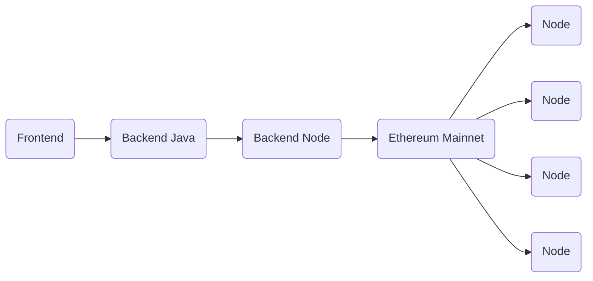

---
# try also 'default' to start simple
theme: vuetiful
# random image from a curated Unsplash collection by Anthony
# like them? see https://unsplash.com/collections/94734566/slidev
background: intro.jpg
# apply any windi css classes to the current slide
class: 'text-center'
# https://sli.dev/custom/highlighters.html
highlighter: shiki
# show line numbers in code blocks
lineNumbers: false
# some information about the slides, markdown enabled
info: |
  ## Slidev Starter Template
  Presentation slides for developers.

  Learn more at [Sli.dev](https://sli.dev)
# persist drawings in exports and build
drawings:
  persist: false
title: Smart contracts con Ethereum | Esteban Platero
---


---

# Indice

- Herramientas
- Solidity
- B2BPay
- Desarrollo Backend
- Desarrollo Frontend

---
background: background1.jpg
layout: section
---

# Herramientas

---
cols: 1-1
slideTitle: Ganache
titleRow: true
---

- Red de pruebas local
- Sencilla
- Intuitiva
- Multiplataforma

<hr class="footnotes-sep">
<section class="footnotes">
  <ul class="footnotes-list">
    <li id="fn1" class="footnote-item">
      <a href="https://trufflesuite.com/ganache/index.html" target="_blank" rel="noopener">Ganache</a> 
    </li>
  </ul>
</section>

<style>
.footnotes-sep {
  @apply mt-48 opacity-10;
}
.footnotes {
  @apply text-sm opacity-75;
}
.footnote-backref {
  display: none;
}
.footnotes-list {
  list-style-type: none;
}
</style>

::right::


---
cols: 1-1
slideTitle: Ganache
titleRow: true
---

- Permite explorar la red
- Cuentas
- Bloques
- Transacciones
- Contracts
- Eventos

::right::


---
layout: image
slideTitle: Ganache
titleRow: true
image: ganache.png
---

---
cols: 1-1
slideTitle: Remix IDE
titleRow: true
---

- IDE Local / Online
- Crear Smart Contracts
- Depuración
- Acceso al estado y las propiedades
- Análisis del código

<hr class="footnotes-sep">
<section class="footnotes">
  <ul class="footnotes-list">
    <li id="fn1" class="footnote-item">
      <a href="https://remix.ethereum.org/" target="_blank" rel="noopener">Remix IDE</a> 
    </li>
  </ul>
</section>

<style>
.footnotes-sep {
  @apply mt-40 opacity-10;
}
.footnotes {
  @apply text-sm opacity-75;
}
.footnote-backref {
  display: none;
}
.footnotes-list {
  list-style-type: none;
}
</style>

::right::


---
layout: image
slideTitle: Remix IDE
titleRow: true
image: remix_ide.png
---

---
cols: 1-1
slideTitle: Metamask
titleRow: true
---

- Extensión para navegador
- Monedero para Ethereum
- Interactuar con dApps [^1]

[^1]: Decentralized Applications  
[Metamask](https://metamask.io/)

::right::


<style>
.footnotes-sep {
  @apply mt-50 opacity-10;
}
.footnotes {
  @apply text-sm opacity-75;
}
.footnote-backref {
  display: none;
}
</style>

---
layout: image-right
slideTitle: Redes
titleRow: true
image: metamask_screen.jpg
---

# Metamask: Redes

- **Mainnet (Producción)**
- Ropsten 
- Rinkeby
- Goerli
- Kovan
- **Localhost (Ganache/Otras)**
- Binance Smart Chain (BSC)

<arrow v-click="1" x1="450" y1="220" x2="650" y2="85" color="#564" width="3" arrowSize="1" />

---
background: background2.jpg
layout: section
---

# Solidity

---
cols: 1-1
slideTitle: Solidity
titleRow: true
---

- Lenguaje de alto nivel
- Tipado estático
- Orientado a objetos
- Programar Smart Contracts para la red de Ethereum (EVM)[^1]
- Sintáxis similar a C++

[^1]: Ethereum Virtual Machine

<style>
.footnotes-sep {
  @apply mt-26 opacity-10;
}
.footnotes {
  @apply text-sm opacity-75;
}
.footnote-backref {
  display: none;
}
</style>

::right::


---
cols: 1-1
slideTitle: "Solidity: Compilación"
titleRow: true
---

#### Instalar compilador
```bash
npm install -g solc
```

#### Smart Contract de ejemplo
```solidity
pragma solidity ^0.5.8;

contract SampleContract {
  function testFunc() public pure returns (int) {
    return 1;
  }
}
```

<style>
  pre {
    @apply mb-6;
  }
</style>

::right::


---
cols: 1-1
slideTitle: "Solidity: Compilación"
titleRow: true
---

#### EVM Bytecode

```bash
$ solc --bin SampleToken.sol

> ======= SampleContract.sol:SampleContract =======
Binary:
6080604052348015600f57600080fd5b5060878061001e6000396000f3fe6080604052348015600f57600080fd5b506004361060285760003560e01c8063037a417c14602d575b600080fd5b60336049565b6040518082815260200191505060405180910390f35b6000600190509056fea265627a7a7230582050d33093e20eb388eec760ca84ba30ec42dadbdeb8edf5cd8b261e89b8d4279264736f6c634300050a0032
```

#### Contract ABI
```bash
$ sold —abi SampleToken.sol

> ======= SampleContract.sol:SampleContract =======
Contract JSON ABI 
[{"constant":true,"inputs":[],"name":"testFunc","outputs":[{"name":"","type":"int256"}],"payable":false,"stateMutability":"pure","type":"function"}]
```

<style>
  pre {
    @apply mb-6;
  }
</style>

::right::


---
layout: quote
---

# Fast Hands-on Solidity

---
cols: 1-1
slideTitle: Solidity
titleRow: true
---

- Condicionales
- Loops
- Herencia
- Interfaces
- Librerias
- Conversion entre tipos
- ...

::right::


---
background: background3.jpg
layout: section
---

# B2BPay

---
cols: 1-1
slideTitle: B2BPay
titleRow: true
---

- Frontend
- Backend Java
- Backend Node
- Blockchain

::right::



---
cols: 1-1
slideTitle: B2BPay
titleRow: true
---

- Estructura del Contrato
  - Id
  - Datos
- Guardar un Contrato
- Recoger un Contrato

::right::

```solidity {all|4-7|all}
pragma solidity ^0.5.0;

contract Contracts {
    struct Contract {
        uint contractId;
        string data;
    }
    mapping (uint => Contract) public contracts;
    address public owner;

    event newContractRegistered(uint id);

    modifier checkSenderIsOwner {
    	require(msg.sender == owner, "You are not the owner.");
    	_;
    }

    constructor() public {
        owner = msg.sender;
    }
}
```

---
cols: 1
slideTitle: Add Contract
titleRow: true
---

```solidity {all|1|5|10|all}
function addContract(uint _contractId, string memory _data) public checkSenderIsOwner
returns(uint)
{
    Contract storage newContract = contracts[_contractId];
    require(newContract.contractId == 0, "Contract already created.");

    newContract.contractId = _contractId;
    newContract.data = _data;

    emit newContractRegistered(_contractId);

    return _contractId;
}
```

---
cols: 1
slideTitle: Get Contract
titleRow: true
---

```solidity {all|6|8-11|all}
function getContractById(uint _id) public view checkSenderIsOwner
returns(
    uint,
    string memory
) {
    Contract memory i = contracts[_id];

    return (
        i.contractId,
        i.data
    );
}
```

---
background: background4.jpg
layout: section
---

# Desarrollo Backend

---
layout: image-right
image: backend_libs.jpg
---

# Librerias backend

- Lib 1
- Lib 2

---
background: background5.jpg
layout: section
---

# Desarrollo Frontend

---
layout: image-right
image: frontend_libs.jpg
---

# Librerias frontend

- Web3.js
- **Ethers**

---
cols: 1-1
---

# Deploy Smart Contract

- ABI
- Bytecode

```js
import { ContractFactory, ethers } from 'ethers';

const provider = new ethers.providers.Web3Provider(
  window.ethereum, "any");
const signer = provider.getSigner();

const factory = new ContractFactory(abi, byteCode, signer);

const contract = await factory.deploy(...args);
// contract.address | contract.deployTransaction

const contract = new ethers.Contract(address, abi);
```

<ConnectedComponent class="mt-8">
  <button @click="deploy()" type="button" class="btn btn-with-icon block">
    <carbon-upload class="text-sm mr-2" />
    <span>Deploy Smart Contract</span>
  </button>
  <div class="mt-2 flex items-center">
    <span class="mr-2">Deployed:</span>
    <carbon-checkmark-outline v-if="store.deployed" class="text-xl text-green-400" />
    <carbon-misuse-outline v-else class="text-xl text-red-400" />
  </div>
</ConnectedComponent>

::right::

<script setup lang="ts">
import { ContractFactory, ethers } from 'ethers';
import { useContractStore } from '/stores/contract';

const store = useContractStore();

const deploy = () => store.deploy();
</script>

<ConnectedComponent class="h-full">
  <div class="pt-16 h-full">
    <Console />
  </div>
</ConnectedComponent>

---
cols: 1-1
---

# Create Contract

```js
const res = await contract.addContract(1, "My data");
```

```js
contract.on('newContractRegistered', (id) => {
  // 
});
```

## Data

<div class="mb-4">
  <label class="block text-gray-700 text-sm font-bold mb-2" for="username">
    Id
  </label>
  <input class="shadow appearance-none border rounded py-1 px-3 text-gray-700 leading-tight focus:outline-none focus:shadow-outline" type="number" name="id" v-model="contractData.id" placeholder="Id">
</div>
<div class="mb-6">
  <label class="block text-gray-700 text-sm font-bold mb-2" for="password">
    Datos
  </label>
  <input class="shadow appearance-none border rounded py-1 px-3 text-gray-700 mb-3 leading-tight focus:outline-none focus:shadow-outline" type="text" name="datos" v-model="contractData.data" placeholder="Datos">
</div>

<ContractDeployedComponent class="mt-8">
  <button @click="addContract()" class="btn btn-with-icon">
    <carbon-add class="text-base mr-2" />
    <span>Create Contract</span>
  </button>
</ContractDeployedComponent>

::right::

<script setup lang="ts">
import { ContractFactory, ethers } from 'ethers';
import { useContractStore } from '/stores/contract';
import { reactive } from 'vue';

const store = useContractStore();

const contractData = reactive({
  id: 1,
  data: "Mis datos",
});

const addContract = async () => await store.addContract(
  parseInt(contractData.id),
  contractData.data,
);
</script>

<ContractDeployedComponent class="h-full">
  <div class="pt-16 h-full">
    <Console />
  </div>
</ContractDeployedComponent>

---
cols: 1-1
---

# Read Contract

```js
const c = await contract.getContractById(1);
```

## Data

<div class="mb-4">
  <label class="block text-gray-700 text-sm font-bold mb-2" for="username">
    Id
  </label>
  <input class="shadow appearance-none border rounded py-1 px-3 text-gray-700 leading-tight focus:outline-none focus:shadow-outline" type="number" name="id" v-model="contractData.id" placeholder="Id">
</div>

<ContractDeployedComponent class="mt-8">
  <button @click="getContract()" class="btn btn-with-icon">
    <carbon-add class="text-base mr-2" />
    <span>Get Contract</span>
  </button>
</ContractDeployedComponent>

::right::

<script setup lang="ts">
import { ContractFactory, ethers } from 'ethers';
import { useContractStore } from '/stores/contract';
import { reactive, ref } from 'vue';

const store = useContractStore();

const contract = reactive({
  id: 0,
  data: "",
});

const contractData = reactive({
  id: 1,
});

const getContract = async () => {
  const c = await store.getContract(
    parseInt(contractData.id),
  );
  console.log('getContract', c);

  contract.id = c[0].toNumber();
  contract.data = c[1];
}

const lines = ref(['Linea 1', 'Linea 2']);
</script>

<ContractDeployedComponent class="mt-16">
  <pre>{{ contract }}</pre>
</ContractDeployedComponent>

---

# Recursos útiles